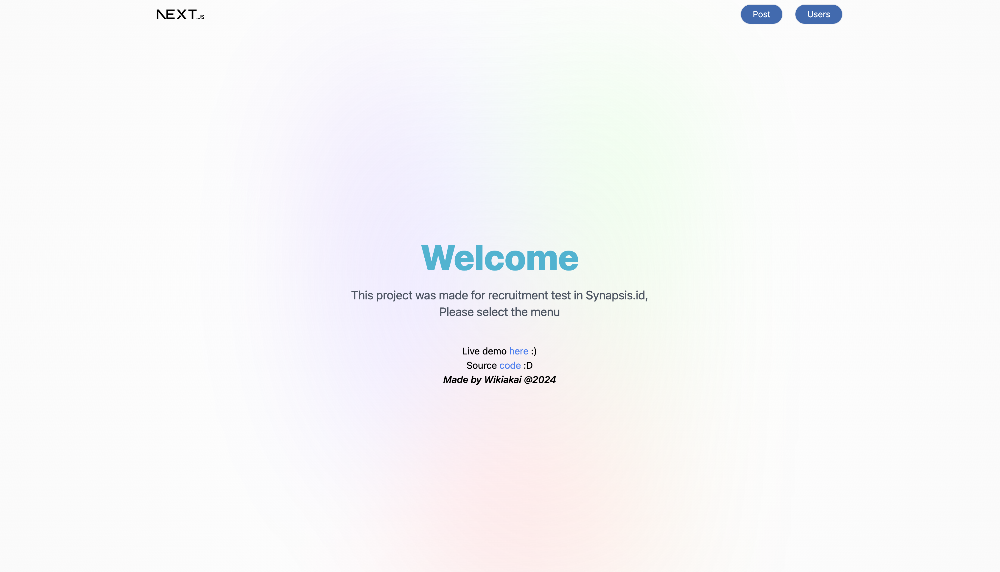

# Front End Test - Malakhi Dwiki

> This project was made for recruitment test in Synapsis.id

> Live Demo https://synapsis-app.vercel.app/ :)

## Quick Start

- Clone the repo: `git clone https://github.com/wikiakai/synapsis-app.git`

- Install dependencies: `npm install` or `yarn`
- Start the server: `npm run dev` or `yarn run dev`
- Views are on: `localhost:3000`

## Tech Stack

- Next : 14
- React : 18
- Tailwind: 3
- Typescript
